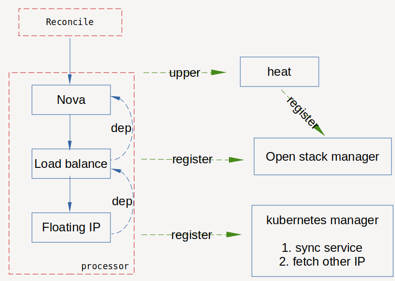

## vm operator

1. sync openstack resource period, include below
    - nova
    - load balance
    - floating ip
    - port
2. create external service on k8s 
    - the external ip is load balance ip
    - require pod which associated service should be allocated ip by neutron

## arch

    
